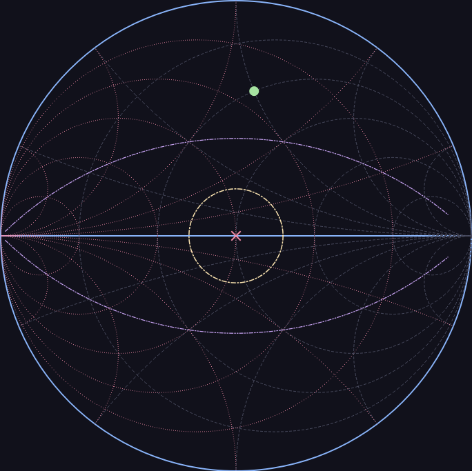
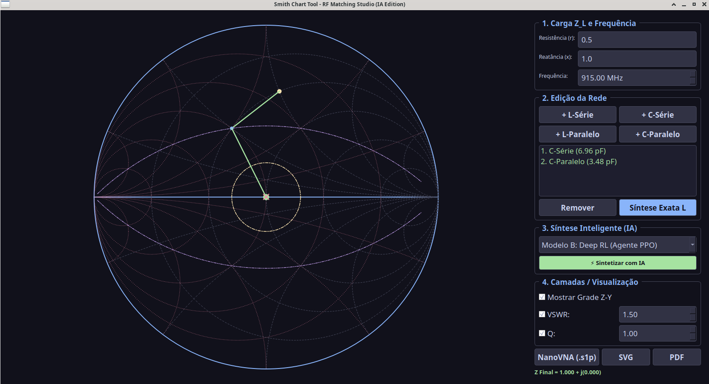

# Smith Chart Tool



### RF Matching Studio (Linux / Cross-Platform)

[](https://opensource.org/licenses/Apache-2.0)


---

Uma ferramenta leve, rápida e nativa em **C++ e Qt6** para visualização na Carta de Smith, análise de impedância e síntese de redes de casamento de RF.

Feita sob medida para engenheiros de radiofrequência, radioamadores e entusiastas de hardware que buscam uma solução direta, enxuta e sem dependências pesadas de ambientes em Python ou simuladores proprietários caros.

---

## 📸 Interface do Usuário



---

## ✨ Principais Recursos

* **Carta de Smith Vetorial Avançada:**
  * Visualização gráfica de alta precisão com suporte a grade combinada **Z-Y** (Impedância e Admitância).
  * Renderização configurável de **Círculos de VSWR** e **Curvas de Q Constante**.

* **Síntese e Casamento de Impedância:**
  * **Síntese Automática de Rede L:** Calcula e aplica instantaneamente os componentes ideais para casar $Z_L$ com $50\ \Omega$.
  * Inserção manual de componentes em série ou paralelo (`+ L-Série`, `+ C-Série`, `+ L-Paralelo`, `+ C-Paralelo`).

* **Integração com Instrumentação:**
  * Importação nativa de arquivos Touchstone **NanoVNA (`.s1p`)** para análise de medições reais de bancada.

* **Exportação de Projetos:**
  * Gerador de relatórios e exportação de gráficos em **SVG** e **PDF** vetoriais.

---

## 🛠️ Tecnologias Utilizadas

* **Linguagem:** C++ (C++17 / C++20)
* **Framework GUI:** Qt 6 (Widgets / QPainter)
* **Compilação:** CMake / qmake


smith_chart/
├── CMakeLists.txt
└── src/
    ├── main.cpp
    ├── types.h
    ├── s1p_parser.h
    ├── s1p_parser.cpp
    ├── smith_chart_canvas.h
    ├── smith_chart_canvas.cpp
    ├── main_window.h
    └── main_window.cpp


---

## 🚀 Como Compilar e Rodar

### Pré-requisitos (Linux/Debian/Ubuntu)

```bash
sudo apt update
sudo apt install build-essential cmake qt6-base-dev
Compilando via CMake
Bash
# Clone o repositório
git clone [https://github.com/AndreFCosta608/smith-chart-tool.git](https://github.com/AndreFCosta608/smith-chart-tool.git)
cd smith-chart-tool-pro

# Crie a pasta de build e compile
mkdir build && cd build
cmake ..
make -j$(nproc)

# Execute o programa
./smith_chart_tool_pro

🤖 Agradecimentos Especiais
"Nenhum transistor foi danificado e nenhum capacitor explodiu durante a criação deste código. Um agradecimento especial ao Gemini, que atuou como copiloto de C++, revisor de matemática de RF e suporte emocional quando a álgebra de números complexos tentou fritar nossos neurônios!" 🚀✨

📄 Licença
Este projeto é distribuído sob a licença Apache 2.0. Veja o arquivo LICENSE para mais detalhes.

Sinta-se à vontade para fazer um fork, abrir issues e enviar pull requests. Toda contribuição é bem-vinda!
